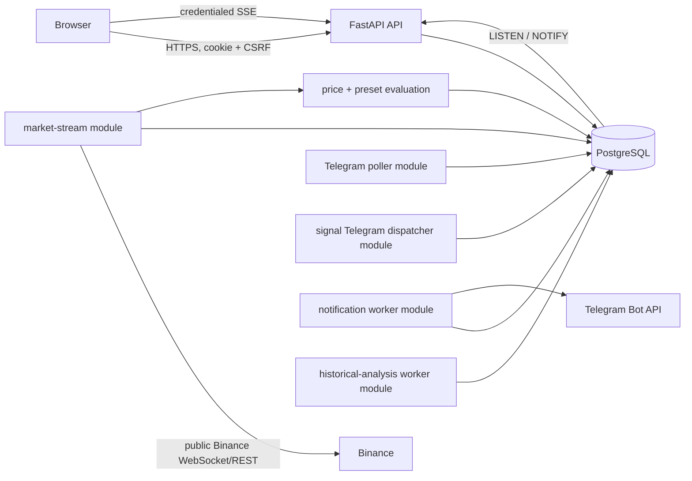
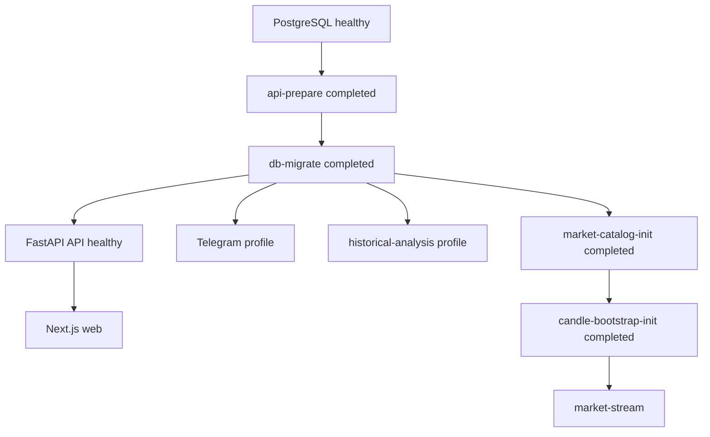

# Architecture

## Purpose

FreeCoinAlert is a modular monolith: the Next.js web app and the FastAPI package share PostgreSQL. This document owns current process boundaries and data flow; [API.md](API.md) owns HTTP contracts and [DATABASE.md](DATABASE.md) owns schema detail.

## Current Repository Layout

`apps/web` is the Next.js browser client. `apps/api` contains FastAPI, SQLAlchemy/Alembic, authentication, Telegram, notifications, market data, candle processing, alerts, strategies, and signals. `docs` contains authoritative contracts. The top-level `services` and `packages` directories are not runnable application boundaries.

## Runtime Topology

The default Compose stack is web, API, and PostgreSQL. Its always-on initialization path is `api-prepare` followed by `db-migrate`; API startup waits for successful migration and web startup waits for API health. The `telegram` profile starts the Telegram update poller, signal Telegram dispatcher, and notification worker after migration. The `market` profile starts catalog and candle initialization before the market stream. The `historical-analysis` profile starts the real historical-analysis worker after migration.

Compose uses one API extension for the API image, source mount, persistent `api_venv` volume, database URL, and `init: true`. Initialization failures stop their dependent branches: migration blocks the API, web, Telegram, market, and historical-analysis services; catalog or candle initialization blocks the market stream. Re-running this graph preserves PostgreSQL and dependency volumes and uses the existing idempotent migration, catalog, and gap-based candle paths.

## Local Orchestration Boundary

The dependency-free `scripts/local-dev.mjs` is a developer-facing orchestration boundary, not a runtime service or new application package. It loads the validated local environment, resolves the Compose profiles, invokes Docker commands with argument arrays and `shell: false`, waits for Compose initialization and health, reads JSON service state, and normalizes readiness/status output. `pnpm dev:all` starts the enabled full-local topology and follows logs; `pnpm dev:all:detached`, `dev:all:logs`, `dev:status`, `dev:down`, and the confirmed `dev:reset` command reuse the same profile resolution. The wrapper does not add an application health endpoint, provider client, queue, or persistent state boundary. Foreground interruption stops log following and removes containers without deleting volumes; reset is the only wrapper path that removes volumes and requires explicit confirmation or `--force`.

## Component Responsibilities

The API routes authenticate browser requests and delegate to domain services. PostgreSQL persists durable state, immutable event history, occurrence-time subscription state history, signal Telegram dispatch state, the signal-feed transport cursor, historical-analysis run state, canonical historical-analysis dataset snapshots, and immutable historical-analysis reports and series. The API process owns a dedicated PostgreSQL listener and bounded in-process SSE connection manager; the listener loads durable rows and fans out only active-subscription sequences to local browser connections. The market stream owns one global Binance Spot aggregate-trade and kline pipeline, canonical candle persistence, aggregation, reconciliation, price-alert evaluation, and preset-signal evaluation. The Telegram poller consumes bot updates idempotently. The signal Telegram dispatcher claims occurrence work, evaluates occurrence-time subscription state, and creates immutable-snapshot outbox jobs without contacting Telegram. The notification worker claims test, price-alert, and preset-signal jobs; it strictly parses preset snapshots, rechecks server-owned delivery state, formats plain-text messages, and calls Telegram only after those checks. Historical-analysis execution is a separate PostgreSQL-backed worker process inside the API package; its pure engine remains a provider-neutral library boundary.

The authenticated root page composes the account, Telegram, price-alert, preset-catalog, signal-feed, and historical-analysis sections. The Telegram panel emits a parent-level connection revision after readiness changes; the preset-signal panel refreshes owner-scoped subscriptions from that signal. The historical-analysis panel uses native credentialed Fetch, in-memory React state/effects, visible-document polling, and an inline SVG/table report view. The browser uses no new state-management, audio, chart, or component dependency and does not calculate historical indicators or metrics.

## Process Ownership and Singleton Boundaries

The market stream uses PostgreSQL advisory lock key `freecoinalert:market-stream:binance:spot` so only one instance owns live ingestion. Signal backfill imports and uses that same singleton boundary. Database rows and unique constraints provide idempotency for retries and restarts; no broker, Redis, or separate microservice is required.

## Primary Data Flows

- Authentication: browser credentials are validated, a hash of a random session token and a CSRF token are stored, and the opaque session cookie is returned.
- Telegram: an authenticated user creates a hashed, short-lived link token; the poller accepts an authenticated bot update once and connects the destination; the worker later sends queued test, price-alert, and preset-signal messages.
- Price alerts: aggregate trades update market state; a crossing atomically creates an immutable alert event and notification-outbox entry, then marks the alert triggered.
- Candles and signals: confirmed one-minute klines are persisted, `1h`/`4h` candles are derived, and active/superseded presets are evaluated against complete current candles. State prevents replay and immutable signal events deduplicate occurrences. Each new live occurrence also gets one durable dispatch row; the dispatcher creates at most one outbox job per eligible user and occurrence.
- Signal feed: signal occurrence and invalidation transactions append a durable sequence row and publish only that sequence through PostgreSQL `NOTIFY`. Each API replica listens independently, resolves active subscribers, and sends safe snapshots or invalidation updates through credentialed SSE. Historical reads use immutable signal events and subscription ownership; transport rows are only a bounded replay cursor.
- Historical analysis: authenticated API routes validate a fixed market/preset/range contract and persist an owner-scoped immutable request snapshot and lifecycle row. The separate database worker claims and recovers runs, uses the internal dataset service to lock the run and bounded current canonical candles, validates coverage, snapshots values atomically, fingerprints the manifest, and marks changed datasets stale. It releases database locks while the pure simulation engine recalculates fixed-preset signals from immutable snapshot inputs, then locks the referenced source candles again and publishes the immutable report, trades, equity points, and succeeded transition atomically. Neither the worker nor report routes contact a provider or mutate live signal/alert/delivery state.
- Subscriptions: users enable a versioned preset for an available supported market; the subscription does not gate global signal evaluation. Lifecycle and explicit Telegram-preference changes update the owner-scoped mutable row and append an immutable state event in one transaction. Readiness is resolved dynamically from the user's Telegram connection; no provider request is made. The dispatcher selects the latest state at occurrence time and checks the current destination's connection time before creating a job.
- Browser presentation: the root signal section loads presets, subscriptions, and a feed watermark concurrently after authentication, opens SSE only after the feed baseline, merges by event ID, recovers on reset or visibility changes, and keeps visual/live-sound presentation separate from occurrence and Telegram delivery. Active preset cards use server-confirmed Telegram preference controls with inline enable confirmation; connection changes refresh readiness without duplicating Telegram ownership or provider state in the signal feature.

## Transaction and Durability Boundaries

API changes commit their owned rows. Price-alert trigger state, event, and notification-outbox insert are one database transaction. Signal state, immutable event, feed stream row, and signal-dispatch row are one transaction. Dispatcher pages create outbox rows and advance the dispatch cursor in the same transaction. Telegram delivery outcome is separate from alert or signal occurrence and is not performed by the dispatcher.

Historical-analysis dataset preparation locks the run and selected canonical rows, then commits the dataset manifest and all candle snapshots atomically. The worker claims at most the configured bounded batch, runs one simulation at a time by default, and checks cancellation at stage boundaries. Current-source validation locks the dataset and references for a bounded check and commits a stale transition when any revision, value, source, or current-row identity changes. Final publication holds source-row share locks while revalidating and writing the report series and succeeded run state in one transaction.

## External Provider Boundaries

Binance market data is public and unauthenticated through a centralized REST/WebSocket client. Telegram access uses the configured bot token only in poller and worker paths. Browser clients never receive provider secrets.

## Failure Isolation and Recovery

The market stream validates freshness and ordering, reconnects with bounded backoff, marks unsafe data stale, and has explicit bootstrap/reconciliation commands. Workers retry temporary Telegram failures through durable outbox state. The signal dispatcher retries bounded database work, requeues stale claims, skips backfilled/invalidated/expired occurrences, and never contacts a provider. Historical work is explicit and bounded so it does not silently become per-user live work. The local wrapper treats failed initialization, unhealthy required services, missing enabled services, and failed optional-enabled workers as startup failures without changing their underlying service semantics.

## Current Scaling Model

One process owns each external stream; PostgreSQL is the shared source of truth. Local in-memory rate limits and process-local work loops are suitable for this single-process model, not distributed deployment.

## Deliberately Deferred Architecture

There is no message broker, cache cluster, independent market-data service, notification service, independent dataset service, report service, or shared-package runtime. Historical-analysis execution is a separately runnable module inside the API package and uses PostgreSQL as its durable queue and report store; it is not a distributed worker pool. Signal-feed delivery intentionally uses PostgreSQL `LISTEN`/`NOTIFY` and a bounded process-local connection manager; it does not add a broker or cross-process connection state. Optimization, comparison, exports, and public report sharing remain deferred. The authenticated browser analysis flow is implemented but unverified and remains a presentation/client-orchestration boundary over the server-owned historical-analysis contracts.

## Verification Status

The local Compose topology and readiness orchestration were verified by a maintainer-requested full-stack startup pass, including API preparation, migrations, market catalogue/bootstrap, API and web health, market-stream startup, and the historical-analysis worker. Signal-feed listener/SSE recovery, browser behavior, and production recovery paths remain unverified.
