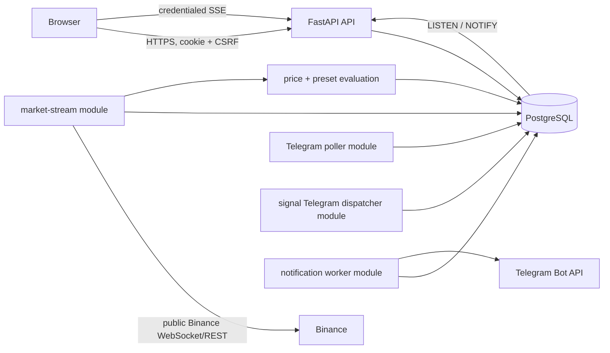

# Architecture

## Purpose

FreeCoinAlert is a modular monolith: the Next.js web app and the FastAPI package share PostgreSQL. This document owns current process boundaries and data flow; [API.md](API.md) owns HTTP contracts and [DATABASE.md](DATABASE.md) owns schema detail.

## Current Repository Layout

`apps/web` is the Next.js browser client. `apps/api` contains FastAPI, SQLAlchemy/Alembic, authentication, Telegram, notifications, market data, candle processing, alerts, strategies, and signals. `docs` contains authoritative contracts. The top-level `services` and `packages` directories are not runnable application boundaries.

## Runtime Topology

The default Compose stack is web, API, and PostgreSQL. The `telegram` profile starts the Telegram update poller, signal Telegram dispatcher, and notification worker; the `market` profile starts the market stream.

## Component Responsibilities

The API routes authenticate browser requests and delegate to domain services. PostgreSQL persists durable state, immutable event history, occurrence-time subscription state history, signal Telegram dispatch state, and the signal-feed transport cursor. The API process owns a dedicated PostgreSQL listener and bounded in-process SSE connection manager; the listener loads durable rows and fans out only active-subscription sequences to local browser connections. The market stream owns one global Binance Spot aggregate-trade and kline pipeline, canonical candle persistence, aggregation, reconciliation, price-alert evaluation, and preset-signal evaluation. The Telegram poller consumes bot updates idempotently. The signal Telegram dispatcher claims occurrence work, evaluates occurrence-time subscription state, and creates immutable-snapshot outbox jobs without contacting Telegram. The notification worker claims test, price-alert, and preset-signal jobs; it strictly parses preset snapshots, rechecks server-owned delivery state, formats plain-text messages, and calls Telegram only after those checks.

The authenticated root page composes the account, Telegram, price-alert, preset-catalog, and signal-feed sections. The Telegram panel emits a parent-level connection revision after readiness changes; the preset-signal panel refreshes owner-scoped subscriptions from that signal. The browser uses native Fetch, EventSource, React state/effects, and Web Audio API without a new frontend state, audio, chart, or component dependency.

## Process Ownership and Singleton Boundaries

The market stream uses PostgreSQL advisory lock key `freecoinalert:market-stream:binance:spot` so only one instance owns live ingestion. Signal backfill imports and uses that same singleton boundary. Database rows and unique constraints provide idempotency for retries and restarts; no broker, Redis, or separate microservice is required.

## Primary Data Flows

- Authentication: browser credentials are validated, a hash of a random session token and a CSRF token are stored, and the opaque session cookie is returned.
- Telegram: an authenticated user creates a hashed, short-lived link token; the poller accepts an authenticated bot update once and connects the destination; the worker later sends queued test, price-alert, and preset-signal messages.
- Price alerts: aggregate trades update market state; a crossing atomically creates an immutable alert event and notification-outbox entry, then marks the alert triggered.
- Candles and signals: confirmed one-minute klines are persisted, `1h`/`4h` candles are derived, and active/superseded presets are evaluated against complete current candles. State prevents replay and immutable signal events deduplicate occurrences. Each new live occurrence also gets one durable dispatch row; the dispatcher creates at most one outbox job per eligible user and occurrence.
- Signal feed: signal occurrence and invalidation transactions append a durable sequence row and publish only that sequence through PostgreSQL `NOTIFY`. Each API replica listens independently, resolves active subscribers, and sends safe snapshots or invalidation updates through credentialed SSE. Historical reads use immutable signal events and subscription ownership; transport rows are only a bounded replay cursor.
- Subscriptions: users enable a versioned preset for an available supported market; the subscription does not gate global signal evaluation. Lifecycle and explicit Telegram-preference changes update the owner-scoped mutable row and append an immutable state event in one transaction. Readiness is resolved dynamically from the user's Telegram connection; no provider request is made. The dispatcher selects the latest state at occurrence time and checks the current destination's connection time before creating a job.
- Browser presentation: the root signal section loads presets, subscriptions, and a feed watermark concurrently after authentication, opens SSE only after the feed baseline, merges by event ID, recovers on reset or visibility changes, and keeps visual/live-sound presentation separate from occurrence and Telegram delivery. Active preset cards use server-confirmed Telegram preference controls with inline enable confirmation; connection changes refresh readiness without duplicating Telegram ownership or provider state in the signal feature.

## Transaction and Durability Boundaries

API changes commit their owned rows. Price-alert trigger state, event, and notification-outbox insert are one database transaction. Signal state, immutable event, feed stream row, and signal-dispatch row are one transaction. Dispatcher pages create outbox rows and advance the dispatch cursor in the same transaction. Telegram delivery outcome is separate from alert or signal occurrence and is not performed by the dispatcher.

## External Provider Boundaries

Binance market data is public and unauthenticated through a centralized REST/WebSocket client. Telegram access uses the configured bot token only in poller and worker paths. Browser clients never receive provider secrets.

## Failure Isolation and Recovery

The market stream validates freshness and ordering, reconnects with bounded backoff, marks unsafe data stale, and has explicit bootstrap/reconciliation commands. Workers retry temporary Telegram failures through durable outbox state. The signal dispatcher retries bounded database work, requeues stale claims, skips backfilled/invalidated/expired occurrences, and never contacts a provider. Historical work is explicit and bounded so it does not silently become per-user live work.

## Current Scaling Model

One process owns each external stream; PostgreSQL is the shared source of truth. Local in-memory rate limits and process-local work loops are suitable for this single-process model, not distributed deployment.

## Deliberately Deferred Architecture

There is no message broker, cache cluster, independent market-data service, notification service, or shared-package runtime. Signal-feed delivery intentionally uses PostgreSQL `LISTEN`/`NOTIFY` and a bounded process-local connection manager; it does not add a broker or cross-process connection state.

## Verification Status

Runtime topology and recovery paths, including signal-feed listener/SSE recovery, are implemented but unverified by a maintainer-requested runtime pass.
